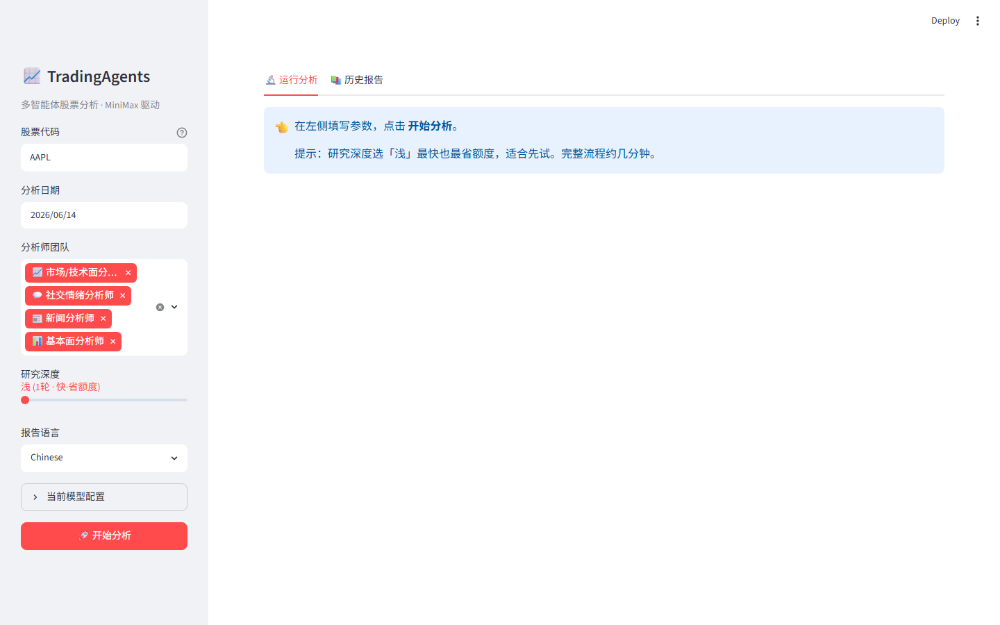

# TradingAgents Web UI (Streamlit)

A lightweight **Streamlit web interface** for
[TradingAgents](https://github.com/TauricResearch/TradingAgents) — the
multi-agent LLM trading-analysis framework. Fill in a ticker, click a button,
watch the agent pipeline run live, and read the rendered report in your browser.
中文界面 / Chinese UI.

> ⚠️ **Disclaimer / 免责声明**: This is a research & learning tool. It is **not
> financial, investment, or trading advice**. Outputs may be wrong. Use at your
> own risk. 仅供研究学习，不构成任何投资建议。

---

## Features / 功能

- 📝 Sidebar form: ticker, date, analyst team, research depth, language
- 🔄 Live pipeline progress (analysts → bull/bear debate → trader → risk → final)
- 🟢🟡🔴 Final decision shown as a big BUY / HOLD / SELL banner
- 📑 Each report section rendered as collapsible Markdown, one-click download
- 📚 History tab to browse and re-read past runs
- 🔑 Provider-agnostic — works with any provider TradingAgents supports
  (OpenAI, Anthropic, Google, DeepSeek, MiniMax, OpenRouter, Ollama, …),
  configured via `.env`. **Each user supplies their own API key.**

## Screenshot / 截图

<!-- 把你的截图放到 docs/ 并改这里的路径 / drop a screenshot in docs/ and update this -->
<!--  -->

## Install / 安装

```bash
git clone https://github.com/ydhawesome/tradingagents-web-ui.git
cd tradingagents-web-ui
python -m venv .venv
# Windows: .venv\Scripts\activate    |    macOS/Linux: source .venv/bin/activate
pip install -r requirements.txt        # installs Streamlit + TradingAgents
cp .env.example .env                    # then edit .env and add your own API key
```

## Run / 运行

```bash
streamlit run app.py
```

Opens at http://localhost:8501. On Windows you can also use the included
`start.bat`.

## Configuration / 配置

All LLM settings (provider, models, language, debate rounds) come from `.env`,
the same file TradingAgents reads. See `.env.example` for the full list.

## Credits / 致谢

Built on [TauricResearch/TradingAgents](https://github.com/TauricResearch/TradingAgents)
(Apache-2.0). This UI is an independent companion project.

## License

Apache-2.0
